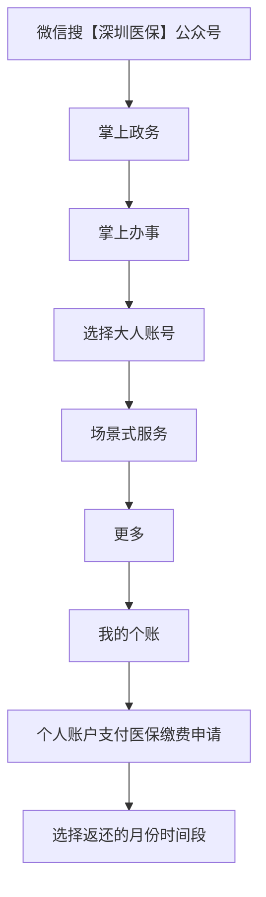

# 个人账户支付医保缴费申请

::: tip 提示

医保缴费时使用支付宝或者微信支付才能申请退费

目的就是使用大人的医保个账来缴费之前购买少儿医保的费用

:::

```mermaid
flowchart TB;
a["微信搜【深圳医保】公众号"]-->掌上政务-->掌上办事-->选择大人账号-->场景式服务-->更多-->我的个账-->个人账户支付医保缴费申请-->选择返还的月份时间段
```

