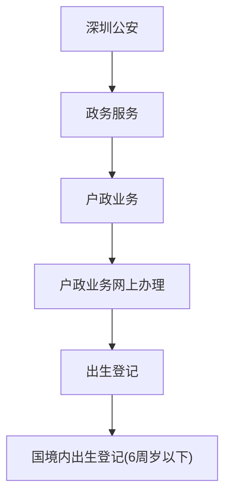
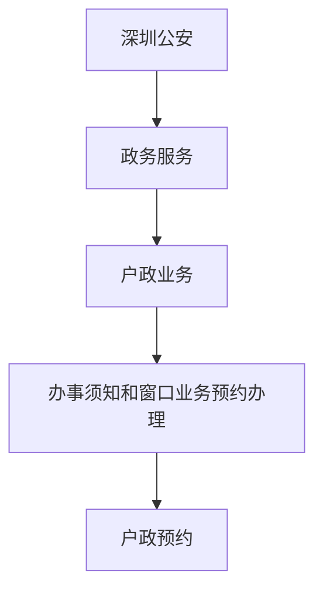

# 办理户口本&身份证流程

## 1、申请出生登记

::: tip 提示

申请一般一两个工作日可以审核通过，接下来就预约去现场办理

:::

## 2、户政预约

当时我找不到预约入口，没有预约，直接到现场办理

>  没有预约直接去现场有个不好的地方就是 取的是现场号，相比有预约叫号要慢一点，当时也没等多久就到我了，所以这个步骤可有可无，预判下到时办理业务的时候人多不多，如果人多最好提前约号

提供一下预约路径

## 3、现场办理【户口所在公安局】

准备材料：

1. 母亲结婚证
2. 跟随父母入户的户口本
3. 宝宝出生证明（需要复印件）
4. 申报人身份证或者户口本
5. 宝宝照片回执（用来办理身份证）

::: tip 提示

因为不太确定需要复印哪些证件所以我只带了原件，客服当时挑了三个证件让我去旁边一个前台那里可以免费复印（有一个证件是出生证明，还有两个忘了，不想那么麻烦就都复印一份）

:::

步骤：

- 到户口所在公安局服务中心，取号
- 等叫号，到常住人口业务窗口，提供原件及复印件
- 上户口
- 办理身份证，只需提供宝宝照片回执，选择邮寄需要18元邮费，一般一周左右能拿到卡

现场办理全程下来也就1个小时，工作人员还说中途出现了一个小问题耽误了20分钟，不然会更快
