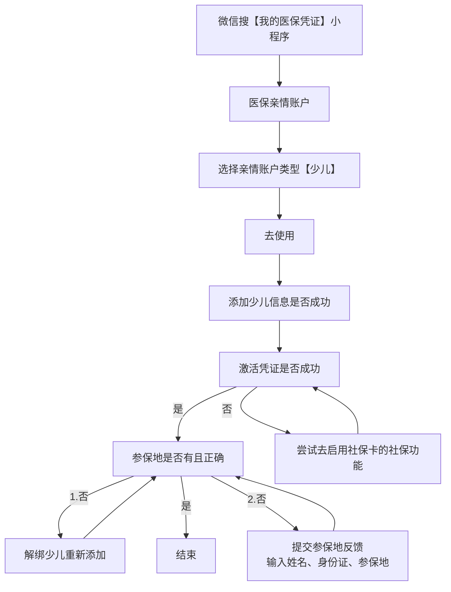
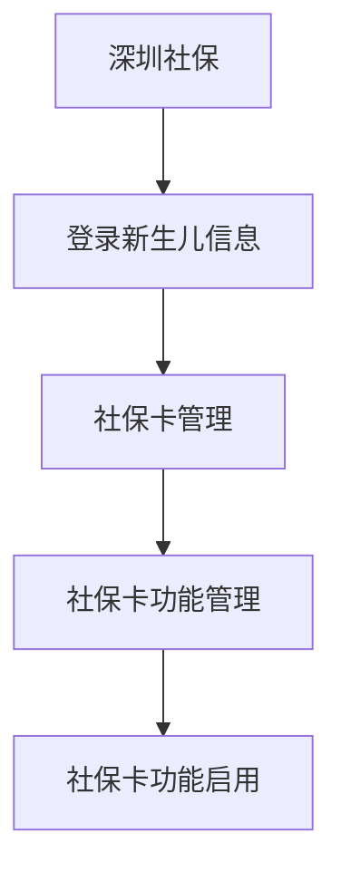

# 激活少儿医保凭证

## 前提

 [购买少儿医保](购买少儿医保.md) 成功后就可以激活少儿医保凭证了

## 流程

```mermaid
flowchart TB;
a["微信搜【我的医保凭证】小程序"]-->医保亲情账户-->b["选择亲情账户类型【少儿】"]-->去使用-->e["添加少儿信息是否成功"]-->d[激活凭证是否成功]--是-->f[参保地是否有且正确]--1.否-->解绑少儿重新添加-->f
f--是-->结束
f--2.否-->g["提交参保地反馈<br>输入姓名、身份证、参保地"]-->f
d--否-->c["尝试去启用社保卡的社保功能"]-->d
```

## 启用社保功能

```mermaid
flowchart TB;
深圳社保-->登录新生儿信息-->社保卡管理-->社保卡功能管理-->社保卡功能启用
```

少儿医保凭证激活成功后，申请金融社保卡 和 报销新生儿科住院费用 可同时进行