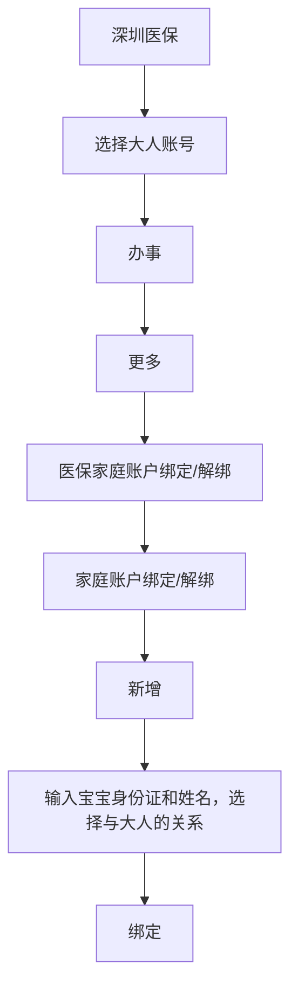

# 绑定父母社保卡

父母社保卡绑定了新生儿宝宝社保卡之后，后续报销住院费用、门诊挂号、打疫苗都可以使用父母个账上的余额，因为宝宝社保卡个账没有余额，如果没有绑定父母社保卡，就只能自费了

```mermaid
flowchart TB;
深圳医保-->选择大人账号-->办事-->更多-->医保家庭账户绑定/解绑-->家庭账户绑定/解绑-->新增-->a[输入宝宝身份证和姓名，选择与大人的关系]-->绑定
```

