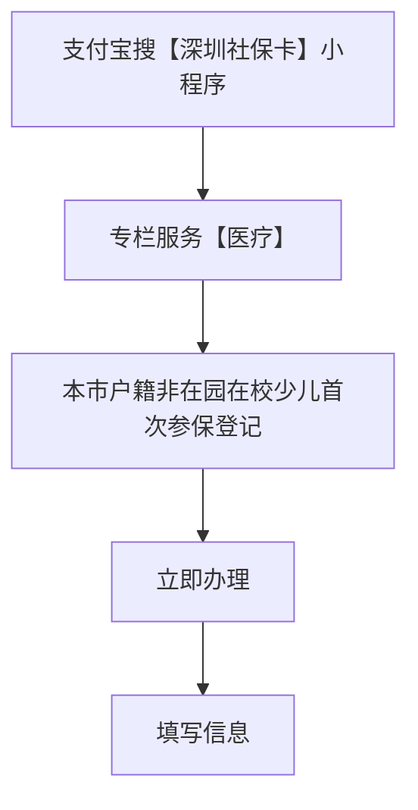
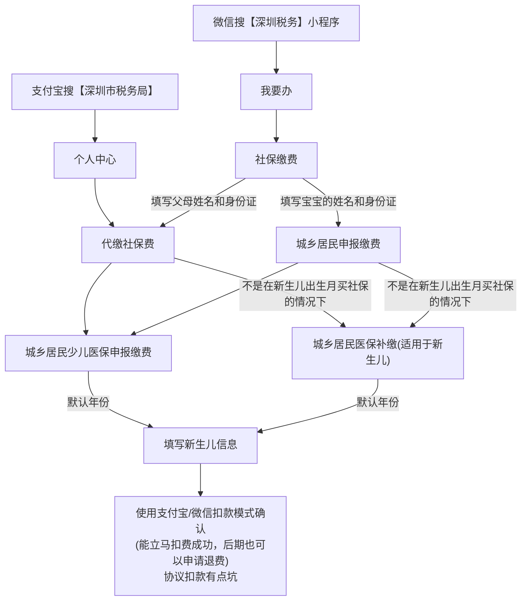

# 购买少儿医保流程

::: tip 提示

微信人脸认证有点麻烦，而且速度还慢，支付宝速度快很多

:::

## 首次参保登记

## 缴费

::: tip 提示

如果买少儿医保时的月份<9月份，那么缴费的结束月份为今年8月份，否则为明年的8月份，一般系统会自动识别的，按系统默认的来

扣费成功后不代表社保缴费成功了，需要3-5个工作日的时间才能查到，等死我了，一天查好几次，查询路径又贼长

:::

查询到缴费状态为 已缴费 时，就可以申请少儿电子医保凭证了

